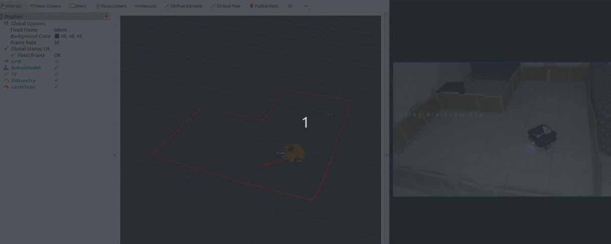

## Working with the Physical MoboBot
> [!NOTE]
> **MoboBot** uses **RaspberryPi 4B** microcomputer running **Ubuntu 22.04** and **ros-humble-base**.
> You can follow this [tutorial](https://robocre8.gitbook.io/robocre8/tutorials/how-to-install-ros2-humble-base-on-raspberry-pi-4b-full-install) to install **ros-humble-base** on **RaspberryPi 4B** with **colcon** and **rosdep**


#

### Prerequisite Dependencies

- install the `libserial-dev` package on the Raspberry Pi 4b machine
  ```shell
  sudo apt-get update
  sudo apt install libserial-dev
  ```
- install cyclone DDS (if you have not) on the Raspberry Pi 4b machine
  ```shell
  sudo apt install ros-humble-rmw-cyclonedds-cpp
  export RMW_IMPLEMENTATION=rmw_cyclonedds_cpp
  echo "export RMW_IMPLEMENTATION=rmw_cyclonedds_cpp" >> ~/.bashrc
  ```
- install opencv on the Raspberry Pi 4b machine
  ```shell
  sudo apt install libopencv-dev python3-opencv
  pip3 install opencv-python
  ```
  
#

### Create ROS Workspace And Download and Setup Necessary Packages

- create your <ros_ws> in the home dir. (replace <ros_ws> with your workspace name)
  ```shell
  mkdir -p ~/<ros_ws>/src
  cd ~/<ros_ws>
  colcon build
  source ~/<ros_ws>/install/setup.bash
  ```

- cd into the src folder of your <ros_ws> and download the mobo_bot packages
  ```shell
  cd ~/<ros_ws>/src
  git clone -b humble https://github.com/robocre8/mobo_bot.git
  ```

- cd into the mobo_bot/mobo_bot_sim folder and add a `COLCON_IGNORE` file to the mobo_bot_sim package to prevent runnig simulation on the Raspberry Pi. 
  ```shell
  cd ~/<ros_ws>/src/mobo_bot/mobo_bot_sim
  touch COLCON_IGNORE
  ```

- cd into the mobo_bot/mobo_bot_rviz folder and add a `COLCON_IGNORE` file to the mobo_bot_rviz package to prevent running rviz visualization on the Raspberry Pi.
  ```shell
  cd ~/<ros_ws>/src/mobo_bot/mobo_bot_rviz
  touch COLCON_IGNORE
  ```

- cd into the mobo_bot/mobo_bot_teleop folder and add a `COLCON_IGNORE` file to the mobo_bot_teleop package to prevent running teleop on the Raspberry Pi.
  ```shell
  cd ~/<ros_ws>/src/mobo_bot/mobo_bot_teleop
  touch COLCON_IGNORE
  ```
  
#

- go back to the `src` folder of your <ros_ws> and download and setup the `epmc_harware_interface` ros2 package for the `L298N EPMC MODULE`
  ```shell
  cd ~/<ros_ws>/src
  git clone -b humble https://github.com/robocre8/epmc_hardware_interface.git
  ```

- go back to the `src` folder of your <ros_ws> and download and setup the `eimu_ros` ros2 package for the `MPU9250 EIMU MODULE`
  ```shell
  cd ~/<ros_ws>/src
  git clone -b humble https://github.com/robocre8/eimu_ros.git
  ```

#

- install rplidar_ros binary package
  ```shell
  sudo apt install ros-humble-rplidar-ros
  ```

- go back to the `src` folder of your <ros_ws> and download the opencv_ros_camera package, from robocre8, for working with the USB camera
  ```shell
  cd ~/<ros_ws>/src
  git clone -b humble https://github.com/robocre8/opencv_ros_camera.git
  ```

#

- cd into the root directory of your <ros_ws> and run rosdep to install all necessary ros  package dependencies
  ```shell
  cd ~/<ros_ws>/
  rosdep install --from-paths src --ignore-src -r -y
  ```
  
#

### Check EPMC (L298N EPMC MODULE), EIMU (MPU9250 EIMU MODULE), RPLIDAR_A1 AND USB Camera PORTS

- check the serial port the connected sensors and motor controller
  > The best way to select the right serial port (if you are using multiple serial device) is to select by path
  ```shell
  ls /dev/serial/by-path
  ```
  > you should see a <value> (if the module is connected and seen by the computer), your serial port would be -> /dev/serial/by-path/<value>. for more info visit this tutorial from [ArticulatedRobotics](https://www.youtube.com/watch?v=eJZXRncGaGM&list=PLunhqkrRNRhYAffV8JDiFOatQXuU-NnxT&index=8)

  > **for the EPMC** (i.e **L298N EPMC MODULE**), go to the `mobo_bot/mobo_bot_description/urdf/`**`epmc_ros2_control.xacro`** file and change the `port` parameter to the port value gotten

  > **for the EIMU** (i.e **MPU9250 EIMU MODULE**), go to the `mobo_bot/mobo_bot_base/`**`eimu_ros_start_params.yaml`** file and change the `port` parameter to the port value gotten. you can also change the `publish_frequency` to maybe 20Hz

  > **for the Lidar**, go to the `mobo_bot/mobo_bot_base/launch/`**`robot.launch.py`** file and change the `serial_port` parameter for the lidar Node to the port value gotten.
  > ````
  > lidar_node = Node(
  >     package='rplidar_ros',
  >     executable='rplidar_node',
  >     name='rplidar_node',
  >     parameters=[{'channel_type': 'serial',
  >                   'serial_port': '/dev/serial/by-path/platform-fd500000.pcie-pci-0000:01:00.0-usb-0:1.1.2:1.0-port0',
  >                   'serial_baudrate': 115200,
  >                   'frame_id': 'lidar',
  >                   'inverted': False,
  >                   'angle_compensate': True,
  >                   'scan_mode': 'Sensitivity'}
  >                   ],
  >     condition=IfCondition(use_lidar),
  >     remappings=[("/scan", "/lidar/scan")],
  >     output='screen'
  > )
  > ````

  > **for the USB Camera**, the video port no, which is by default 0, and every other should be okay. <br/>
  > But if you still intend to adjust anything, go to the `mobo_bot/mobo_bot_base/launch/`**`robot.launch.py`** file to change any of the camera parameters
  > 
  > ````
  > camera_node = Node(
  >     package='opencv_ros_camera',
  >     executable='camera_publisher',
  >     name='camera_publisher',
  >     output='screen',
  >     parameters=[{'frame_id': "camera_optical",
  >                   'port_no': 0,
  >                   'frame_width': 320,
  >                   'frame_height': 240,
  >                   'compression_format': "jpeg", # you can also use "jpeg"
  >                   'publish_frequency': 30.0}
  >                 ],
  >     condition=IfCondition(use_camera),
  > )
  > ````

#

### Build The MoboBot Packages and the Different Hardware Packages

- build your <ros_ws>
  ```shell
  cd ~/<ros_ws>/
  colcon build --symlink-install
  ```

- don't forget to source your <ros_ws> in any new terminal
  ```shell
  source ~/<ros_ws>/install/setup.bash
  ```

> [!NOTE]
> You can further edit the parameters of the .yaml files in the mobo_bot_base package config folders

#

### Clone and Build The MoboBot packages on your dev-PC connected (via ssh) to the Raspberry PI on the MoboBot robot

- pls follow the [mobo_bot_sim tutorial](https://github.com/robocre8/mobo_bot/blob/humble/MOBO_BOT_SIM_README.md) for dev-PC
- you'll be using the mobo_bot_rviz package on your dev-PC to visualize the robot.

#

### Test the MoboBot Hardware and Sensors
Run all these tests to check if any sensor or hardware gives any error.<br/>
- to test the EPMC Motor Controller (and the rsp with base control), run the following
  ```shell
  ros2 launch mobo_bot_hw_test epmc_test.launch.py
  ```
- to test the EIMU Module, run the following
  ```shell
  ros2 launch mobo_bot_hw_test eimu_test.launch.py
  ```
- to test the Lidar, run the following
  ```shell
  ros2 launch mobo_bot_hw_test lidar_test.launch.py
  ```
- to test the USB Camera, run the following
  ```shell
  ros2 launch mobo_bot_hw_test camera_test.launch.py
  ```
> [!NOTE]
> If any error occurs, first unplug the lidar (from the USB HUB) and plug it back
> then unplug the USB HUB from the Raspberry Pi Port and plug it back.
> Everything should now work.


#

### Run the Physical MoboBot



- on the Raspberry Pi 4b, open a new terminal and start the mobo_bot_base
  ```shell
  source ~/<ros_ws>/install/setup.bash
  ros2 launch mobo_bot_base robot.launch.py
  ```
> [!NOTE]
> If any error occurs, first unplug the lidar (from the USB HUB) and plug it back
> then unplug the USB HUB from the Raspberry Pi Port and plug it back.
> Everything should now work.
> launch the mobo_bot_base again

- on Your dev-PC, open a new terminal and start the mobo_bot_rviz by running
  ```shell
  source ~/<ros_ws>/install/setup.bash
  ros2 launch mobo_bot_rviz robot.launch.py
  ```
> You should now see the robot visuals on your dev-PC

#

### Drive the MoboBot with a special arrowkey teleop
- on your Dev PC, in a different terminal, run the mobo_bot_teleop to drive the robot around using the arrow keys on your keyboard
  ```shell
  source ~/<ros_ws>/install/setup.bash
  ros2 run mobo_bot_teleop mobo_bot_teleop
  ```
  OR
  ```shell
  source ~/<ros_ws>/install/setup.bash
  ros2 run mobo_bot_teleop mobo_bot_teleop <v in m/s> <w in rad/sec>
  ```

