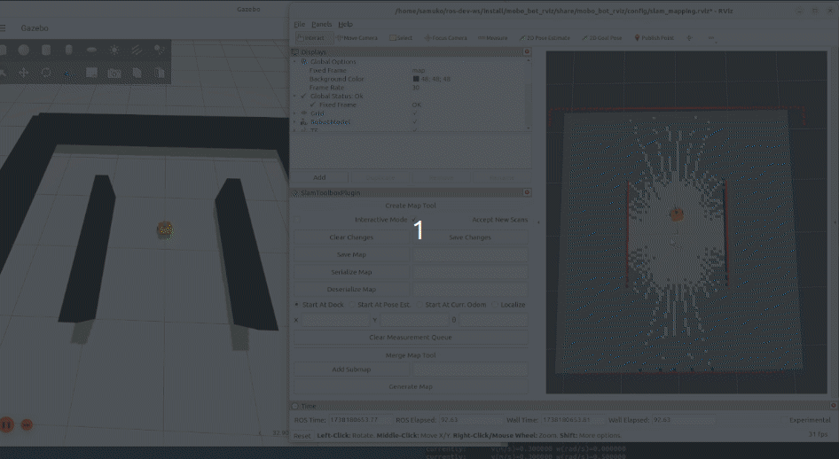
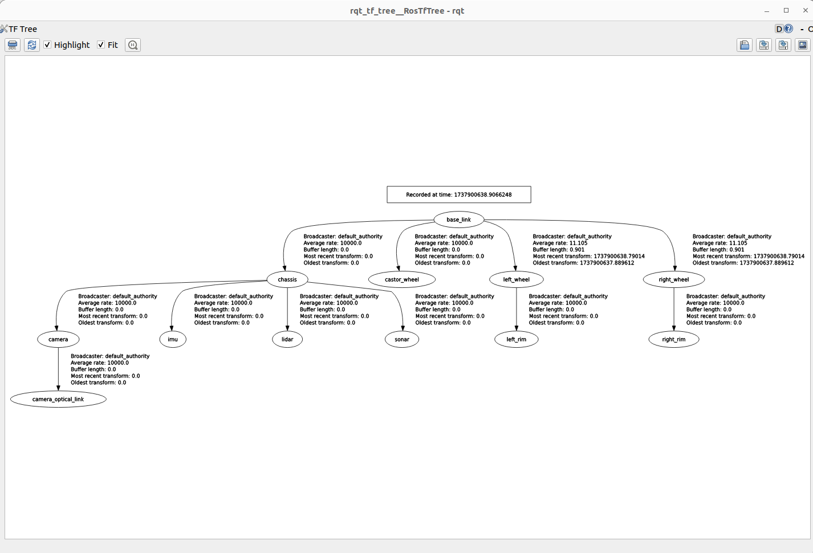
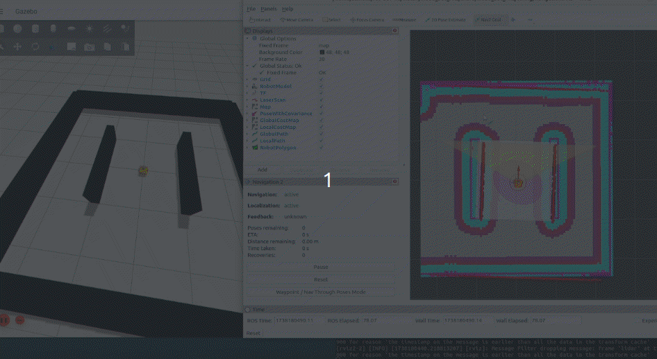

## MoboBot Gazebo Simulation



> [!NOTE]
> Your Dev PC must be running **Ubuntu 22.04** and **ros-humble-desktop** with **gazebo igintion fortress**.
> </br>
> You can follow this [**tutorial**](https://robocre8.gitbook.io/robocre8/tutorials/how-to-install-ros2-humble-desktop-on-pc-full-install) to install **ros-humble-desktop** on **PC**
> </br>
> The **ignition gazebo** would be installed as you follow the installation process below.

#

### Some Prerequisites

- Install and set up Cyclone DDS on your PC (if you don't have it installed yet).
  ```shell
  sudo apt install ros-humble-rmw-cyclonedds-cpp
  export RMW_IMPLEMENTATION=rmw_cyclonedds_cpp
  echo "export RMW_IMPLEMENTATION=rmw_cyclonedds_cpp" >> ~/.bashrc
  ```
  
- Create your MoboBot ROS Workspace
  ```shell
  mkdir -p ~/mobo_bot_ws/src
  cd ~/mobo_bot_ws
  colcon build
  source ~/mobo_bot_ws/install/setup.bash
  ```

- Clone the **arrow_key_telop_drive** package on your MoboBot ROS Workspace. This is the package that would be used for driving the MoboBot using the arrow keys of your keyboard
  ```shell
  sudo apt install python3-pip
  pip3 install pynput
  pip3 install setuptools==58.2.0
  cd ~/mobo_bot_ws/src
  git clone https://github.com/samuko-things/arrow_key_teleop_drive.git
  ```
  Learn more about the [**arrow_key_teleop_drive**](https://github.com/samuko-things/arrow_key_teleop_drive)

- Build your workspace
  ```shell
  cd ~/mobo_bot_ws
  colcon build --symlink-install
  ```

### Clone and Build the MoboBot Packages  
- cd into the src folder of your mobo_bot_ws and download the **MoboBot** packages
  ```shell
  cd ~/mobo_bot_ws/src
  git clone -b humble https://github.com/robocre8/mobo_bot.git
  ```
  
- If you are not interested in running or testing the MoboBot hardware (i.e the actual robot), run the following command below. this will add the COLCON_IGNORE file to it.
  </br>If not, please go ahead and skip this, then check the [**Working with the Actual MoboBot**]() tutorial.
  ```shell
  cd ~/mobo_bot_ws/src/mobo_bot/mobo_bot_base
  touch COLCON_IGNORE
  ```

- cd into the root directory of your mobo_bot_ws and run rosdep to install all necessary ROS  package dependencies
  ```shell
  cd ~/mobo_bot_ws
  rosdep update
  rosdep install --from-paths src --ignore-src -r -y
  ```

- Build your mobo_bot_ws
  ```shell
  cd ~/mobo_bot_ws
  colcon build --symlink-install
  ```

- Don't forget to source your <ros_ws> in any new terminal
  ```shell
  source ~/mobo_bot_ws/install/setup.bash
  ```

#

### View Robot and Transform Tree

- on your dev-PC, open a new terminal and start the robot state publisher node
  ```shell
  source ~/<ros_ws>/install/setup.bash
  ros2 launch mobo_bot_description rsp.launch.py use_joint_state_pub:=true
  ```
- in a different terminal, run the rviz launch file to view the robot
  ```shell
  source ~/<ros_ws>/install/setup.bash
  ros2 launch mobo_bot_rviz rsp.launch.py
  ```
- To view the transform tree, in a different terminal (while the robot state publisher is still running), run the following
  ```shell
  ros2 run rqt_tf_tree rqt_tf_tree
  ```

#

### Run the MoboBot simulation
- On your dev-PC, open a new terminal and start the mobo_bot_sim 
  ```shell
  source ~/mobo_bot_ws/install/setup.bash
  ros2 launch mobo_bot_bringup sim.launch.py
  ```
- In a different terminal, run the mobo_bot_teleop to drive the robot around using the arrow keys on your keyboard
  ```shell
  source ~/mobo_bot_ws/install/setup.bash
  ros2 run arrow_key_teleop_drive arrow_key_telop_drive
  ```
  OR
  ```shell
  source ~/mobo_bot_ws/install/setup.bash
  ros2 run arrow_key_teleop_drive arrow_key_telop_drive 0.2 0.8
  ```
  
#

### Run the mobo_bot_sim with navigation

- to just build map of the world with slam run:
  ```shell
  source ~/mobo_bot_ws/install/setup.bash
  ros2 launch mobo_bot_bringup sim_with_mapping_slam.launch.py
  ```
  Then drive the robot around with teleop
  >NOTE: Whenever you build a new map you can save it using the command below:
  >```shell
  >   ros2 run nav2_map_server map_saver_cli -f /path/to/save/<map_name>  # Saves the current map to the specified path and file name
  >```
  > example:
  >```shell
  >   ros2 run nav2_map_server map_saver_cli -f ~/mobo_bot_ws/src/mobo_bot/mobo_bot_navigation/maps/<map_name>  # Saves the current map to the mobo_bot map folder
  >```

- to try the 2D navigation with simulation (using the existing world and map):
  ```shell
  source ~/mobo_bot_ws/install/setup.bash
  ros2 launch mobo_bot_bringup sim_with_navigation_amcl.launch.py
  ```
  OR
  ```shell
  source ~/mobo_bot_ws/install/setup.bash
  ros2 launch mobo_bot_bringup sim_with_navigation_slam.launch.py
  ```
  use the Nav2Goal button to move the robot from point to point.

#

### Drive MoboBot with a special arrow-key teleop
- in a different terminal, run the mobo_bot_teleop to drive the robot around using the arrow keys on your keyboard
  ```shell
  source ~/mobo_bot_ws/install/setup.bash
  ros2 run arrow_key_teleop_drive arrow_key_telop_drive
  ```
  OR
  ```shell
  source ~/mobo_bot_ws/install/setup.bash
  ros2 run arrow_key_teleop_drive arrow_key_telop_drive <v in m/s> <w in rad/sec>
  ```
