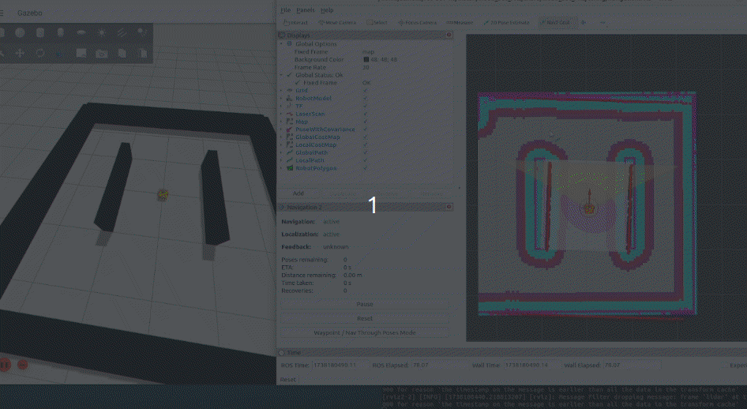

## SETUP MOBO_BOT_SIM ON YOUR DEV PC
> [!NOTE]
> Your Dev PC must be running **Ubuntu 22.04** and **ros-humble-desktop** with **gazebo igintion fortress**.
> You can follow this [tutorial]() to install **ros-humble-desktop** on **PC**
> Ignition gazebo would be installed as you follow the installation process below.

#

### Create ROS Workspace And Download and Setup mobo_bot Packages
- install python pynput library for the mobo_bot_teleop
  ```shell
  pip3 install pynput
  ```

- create your <ros_ws> in the home dir. (replace <ros_ws> with your workspace name)
  ```shell
  mkdir -p ~/<ros_ws>/src
  cd ~/<ros_ws>
  colcon build
  source ~/<ros_ws>/install/setup.bash
  ```

- cd into the src folder of your <ros_ws> and download the mobo_bot packages
  ```shell
  cd ~/<ros_ws>/src
  git clone https://github.com/robocre8/mobo_bot.git
  ```

- cd into the mobo_bot/mobo_bot_base folder and add a `COLCON_IGNORE` file to the mobo_bot_base package to prevent the running of mobo_bot_base
  ```shell
  cd ~/<ros_ws>/src/mobo_bot/mobo_bot_base
  touch COLCON_IGNORE
  ```

- cd into the root directory of your <ros_ws> and run rosdep to install all necessary ros  package dependencies
  ```shell
  cd ~/<ros_ws>/
  rosdep install --from-paths src --ignore-src -r -y
  ```

- build your <ros_ws>
  ```shell
  cd ~/<ros_ws>/
  colcon build --symlink-install
  ```

- don't forget to source your <ros_ws> in any new terminal
  ```shell
  source ~/<ros_ws>/install/setup.bash
  ```

#

### View Robot and Transform Tree

- on your dev-PC, open a new terminal and start the robot state publisher node
  ```shell
  source ~/<ros_ws>/install/setup.bash
  ros2 launch mobo_bot_description rsp.launch.py use_joint_state_pub:=true
  ```
- in a differnt terminal, run the rviz launch file to view the robot
  ```shell
  source ~/<ros_ws>/install/setup.bash
  ros2 launch mobo_bot_rviz rsp.launch.py
  ```
- To view transform tree, in a differnt terminal (while robot state publisher is still runing), run the following
  ```shell
  ros2 run rqt_tf_tree rqt_tf_tree
  ```

#

### Run the mobo_bot_sim

- on your dev-PC, open a new terminal and start the mobo_bot_sim 
  ```shell
  source ~/<ros_ws>/install/setup.bash
  ros2 launch mobo_bot_sim sim.launch.py
  ```
- in a differnt terminal, run the mobo_bot_teleop to drive the robot around using the arrow keys on your keyboard
  ```shell
  source ~/<ros_ws>/install/setup.bash
  ros2 run mobo_bot_teleop mobo_bot_teleop
  ```
  OR
  ```shell
  source ~/<ros_ws>/install/setup.bash
  ros2 run mobo_bot_teleop mobo_bot_teleop <v in m/s> <w in rad/sec>
  ```
  
#

### Run the mobo_bot_sim with navigation

- to just build map of the world with slam run:
  ```shell
  source ~/<ros_ws>/install/setup.bash
  ros2 launch mobo_bot_sim slam_mapping.launch.py
  ```
  >NOTE: whenever you build a new map you can save it using the command below:
  >```shell
  >   ros2 run nav2_map_server map_saver_cli -f /path/to/save/<map_name>  # Saves the current map to the specified path and file name
  >```
  > example:
  >```shell
  >   ros2 run nav2_map_server map_saver_cli -f ~/<ros_ws>/src/mobo_bot/mobo_bot_sim/map/<map_name>  # Saves the current map to the mobo_bot_sim map folder
  >```


- to try out only the amcl localization so see how it works, using the existing map:
  > NOTE: you can also change the map path in the amcl launch file
  ```shell
  source ~/<ros_ws>/install/setup.bash
  ros2 launch mobo_bot_sim amcl.launch.py
  ```

- to tryout the 2D navigation with simulation (using the existing world and map):
  ```shell
  source ~/<ros_ws>/install/setup.bash
  ros2 launch mobo_bot_sim nav_bringup.launch.py
  ```
> NOTE: change slam parameter in the launch file to 'True' to use 2D navigation with slam mapping

#

### Drive your robot with teleop
- in a differnt terminal, run the mobo_bot_teleop to drive the robot around using the arrow keys on your keyboard
  ```shell
  source ~/<ros_ws>/install/setup.bash
  ros2 run mobo_bot_teleop mobo_bot_teleop
  ```
  OR
  ```shell
  source ~/<ros_ws>/install/setup.bash
  ros2 run mobo_bot_teleop mobo_bot_teleop <v in m/s> <w in rad/sec>
  ```