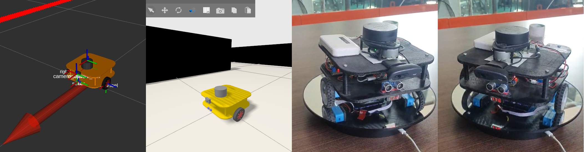
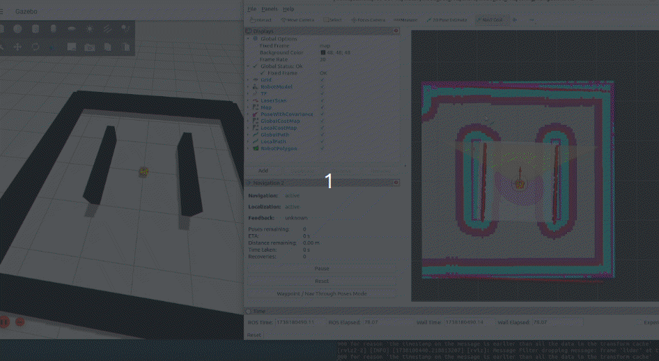

## mobo-bot

This is an an open-source differential drive ROS2-based educational robot (similar to the popular *Turtlebot*, *Andino bot*, *limo robot*, etc.), created by Samuel Obiagba (aka [samuko-things](https://github.com/samuko-things)) founder of [**robocre8**](https://github.com/robocre8),  to learn advanced mobile robotics concepts such as `control`, `sensor-fusion`, `localization`, `navigation`, `perception`, `Artificial Intelligence`, etc. using the **ROS2** framework as well as Arduino also.
 
 
This will ensure the longevity and future of open-source robotics in Nigeria and Africa, as well as the world, by aiding the learning and building of advanced mobile robots, leveraging the use of the ROS2 and Arduino Frameworks.
 
- It uses the [EPMC module]() and [EIMU Module]() for its base control.
- It has a gazebo ign simulation environment where algorithms can be tested before being implemented on the robot.
- It is both easy to work with and build.
- Learning robotics has never been more easy.

#

### GETTING STARTED WITH SIMULATION (`mobo_bot_sim`)
**`mobo_bot_sim`** is the **mobo_bot** ROS2 simulation with Gazebo Ignition.

- To Simulate the **mobo_bot** on you **dev-PC** follow this [mobo_bot_sim tutorial](https://github.com/samuko-things-company/mobo_bot/blob/humble/MOBO_BOT_SIM_README.md)

#

### WORKING WITH THE ACTUAL ROBOT (`mobo_bot_base` and `mobo_bot_rviz`)
**`mobo_bot_base`** is the base control package for the actual physical **mobo_bot** robot. it launches all the controls, sensor-fusion, lidar and camera, to get started with working with the robot.

the **mobo_bot_base** package is meant to run on the Raspberry Pi 4 on the robot.

**`mobo_bot_rviz`** is meant to run on your Dev PC which will be connected to the robot via ssh. For visualiging the robot state, sensor data, navigation, etc.

- to get started with the actual physical **mobo_bot** robot (which uses the Raspberry Pi 4), follow this [mobo_bot_base tutorial](https://github.com/samuko-things-company/mobo_bot/blob/humble/MOBO_BOT_BASE_README.md)
