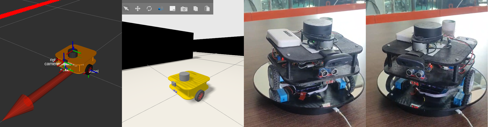

## MoboBot

**MoboBot** is a compact yet powerful open-source robot designed to help students, makers, and engineers explore mobile robotics with ROS2—both in real-world applications and simulation.
 
It is an open-source differential drive ROS2 educational robot (similar to the popular TurtleBot, Andino, Lino robot, Duckiebot etc.), created to foster hands-on learning of advanced mobile robotics concepts such as **sensor-fusion**, **control**, **state-estimation**, **localization**, **SLAM**, **navigation**, **obstacle avoidance**, **perception**, and **AI**, leveraging the use of ROS2 (as well as Arduino) Framework.
 
This will ensure the longevity and future of open-source robotics in Nigeria and Africa, as well as the world.
 
  **Key Features**
 ✅ Powered by Raspberry Pi 4B for onboard processing
 ✅ RPLidar C1 for SLAM, AMCL and Navigation (pre-configured with Nav2)
 ✅ It uses the [EPMC module](https://github.com/robocre8/epmc_documentation) and [EIMU Module](https://github.com/robocre8/eimu_documentation) for its base control and sensor fusion (EKF).
 ✅ USB Camera for OpenCV + ROS2  perception and camera streaming
 ✅ Gazebo Ignition simulation environment for algorithm test before implementation.
 ✅ Easy to work with and build.
 ✅ Learning robotics has never been easier.

#

### YOUTUBE VIDEOS

- [**Check out the YouTube Videos Here**](https://www.youtube.com/watch?v=dXGVaBl08jw&t=2s)

#
### GETTING STARTED WITH MoboBot

 
- [**Simulation Tutorial**](https://github.com/robocre8/mobo_bot/blob/humble/MOBO_BOT_SIM_README.md)

 

 
- [**Working with the Actual Robot**](https://github.com/robocre8/mobo_bot/blob/humble/MOBO_BOT_BASE_README.md)

 
